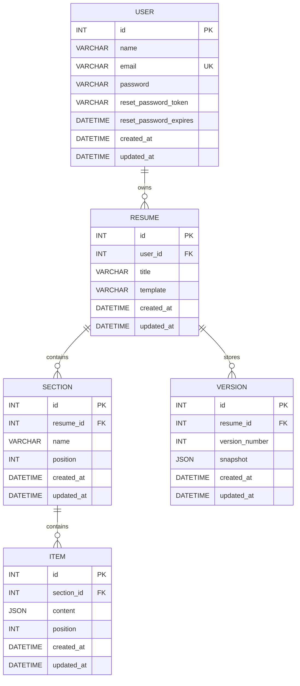

# ResumeFlow 🚀

> A modular, authenticated REST API for building, managing, importing, duplicating, versioning, and restoring resumes.

ResumeFlow is a backend project built with **Node.js, Express.js, Sequelize, and MySQL**. The project is designed around a hierarchical resume model where users own resumes, resumes contain sections, sections contain items, and resumes can have saved versions for recovery and rollback.

## ✨ Project Highlights

- 🔐 JWT-based authentication
- 🔑 Secure password hashing with bcrypt
- 🔄 Forgot-password and reset-password flow
- 👤 User profile management
- 📄 Resume CRUD operations
- 📥 Resume import workflow
- 📋 Resume duplication
- 🧩 Nested resume sections
- 📝 Nested resume items
- 🕐 Resume version history
- ↩️ Version restoration / rollback
- 🛡️ Parent-resource ownership checks
- 🗄️ MySQL persistence through Sequelize ORM
- 🔗 Foreign-key relationships with cascading behavior
- ✅ Model/request validation
- 🧪 API testing through Postman
- 📦 Sequelize migrations
- 📚 Structured REST API design

---

# 🏗️ Architecture

```text
                         ┌──────────────────────┐
                         │       Client         │
                         │ Postman / Frontend   │
                         └──────────┬───────────┘
                                    │
                                    ▼
                         ┌──────────────────────┐
                         │      Express API     │
                         │       Routes         │
                         └──────────┬───────────┘
                                    │
                                    ▼
                         ┌──────────────────────┐
                         │     Middleware       │
                         │ Auth / Validation    │
                         └──────────┬───────────┘
                                    │
                                    ▼
                         ┌──────────────────────┐
                         │     Controllers      │
                         │    Business Logic    │
                         └──────────┬───────────┘
                                    │
                                    ▼
                         ┌──────────────────────┐
                         │      Sequelize       │
                         │       Models         │
                         └──────────┬───────────┘
                                    │
                                    ▼
                         ┌──────────────────────┐
                         │        MySQL         │
                         │       Database       │
                         └──────────────────────┘
```

The codebase separates:

- **Routes** — endpoint definitions
- **Middleware** — authentication and request processing
- **Controllers** — API/business logic
- **Models** — database entities and relationships
- **Migrations** — version-controlled schema changes
- **Database** — persistent application state

---

# 🧱 Project Structure

```text
ResumeFlow/
│
├── config/
│
├── controllers/
│   ├── authController.js
│   ├── userController.js
│   ├── resumeController.js
│   ├── sectionController.js
│   ├── itemController.js
│   └── versionController.js
│
├── middleware/
│   ├── authentication middleware
│   ├── validation middleware
│   └── error handling
│
├── migrations/
│   ├── users
│   ├── resumes
│   ├── sections
│   ├── items
│   ├── versions
│   └── password reset fields
│
├── models/
│   ├── user.js
│   ├── resume.js
│   ├── section.js
│   ├── item.js
│   └── version.js
│
├── routes/
│   ├── auth.js
│   ├── users.js
│   ├── resumes.js
│   ├── sections.js
│   ├── items.js
│   └── versions.js
│
├── seeders/
│
├── .env
├── .gitignore
├── app.js
├── package.json
└── README.md
```

---

# 🗃️ Data Model

ResumeFlow uses a hierarchical relational model:

```text
User
 │
 └───< Resume
          │
          ├───< Section
          │        │
          │        └───< Item
          │
          └───< Version
```

| Parent | Child | Relationship |
|---|---|---|
| User | Resume | One-to-Many |
| Resume | Section | One-to-Many |
| Section | Item | One-to-Many |
| Resume | Version | One-to-Many |

The ownership chain is:

```text
Authenticated User
       ↓
     Resume
       ↓
    Section
       ↓
      Item
```

---

# 📊 Database Schema

## Users

```text
users
├── id
├── name
├── email
├── password
├── reset_password_token
├── reset_password_expires
├── created_at
└── updated_at
```

- `email` is unique
- passwords are bcrypt hashes
- reset fields are nullable
- emails are normalized before persistence

## Resumes

```text
resumes
├── id
├── user_id
├── title
├── template
├── created_at
└── updated_at
```

## Sections

```text
sections
├── id
├── resume_id
├── name
├── position
├── created_at
└── updated_at
```

## Items

```text
items
├── id
├── section_id
├── content
├── position
├── created_at
└── updated_at
```

`content` is JSON to support different types of resume entries.

## Versions

```text
versions
├── id
├── resume_id
├── version_number
├── snapshot
├── created_at
└── updated_at
```

A unique composite index is used for:

```text
(resume_id, version_number)
```

---

# 🔗 ER Diagram



---

# 🔐 Authentication & Security

ResumeFlow uses **JWT authentication** for protected resources.

After login:

```text
Authorization: Bearer <JWT>
```

Protected controllers access the authenticated user through:

```js
req.user.id
```

That ID is then used for authorization and resource ownership checks.

## Password Security

Passwords are hashed with **bcrypt** through Sequelize lifecycle hooks.

This means password hashing is centralized at the model level instead of being duplicated throughout controllers.

---

# 🔑 Authentication APIs

| Method | Endpoint | Purpose |
|---|---|---|
| POST | `/api/auth/register` | Register a user |
| POST | `/api/auth/login` | Login and receive JWT |
| POST | `/api/auth/logout` | Logout |
| POST | `/api/auth/forgot-password` | Generate reset token |
| POST | `/api/auth/reset-password` | Reset password |

### Register

```http
POST /api/auth/register
```

```json
{
  "name": "Deepesh",
  "email": "deepesh@example.com",
  "password": "Password123"
}
```

### Login

```http
POST /api/auth/login
```

```json
{
  "email": "deepesh@example.com",
  "password": "Password123"
}
```

Successful login returns a JWT.

### Logout

```http
POST /api/auth/logout
```

The current implementation returns a successful logout response. The project does not maintain a server-side JWT blacklist.

### Forgot Password

```http
POST /api/auth/forgot-password
```

A cryptographically random reset token is generated and stored with a **1-hour expiry**.

For this internship implementation, the token is returned directly so the flow can be tested without an external email service.

### Reset Password

```http
POST /api/auth/reset-password
```

```json
{
  "resetToken": "<token-from-forgot-password>",
  "password": "NewPassword123"
}
```

The API:

1. Finds the user using the token
2. Checks expiry
3. Assigns the new password
4. Lets the model hook hash it
5. Clears the token
6. Clears the expiry

A successful reset invalidates the token.

---

# 👤 User APIs

| Method | Endpoint | Description |
|---|---|---|
| GET | `/api/users` | Get all users |
| GET | `/api/users/profile` | Get current user profile |
| GET | `/api/users/profile/:id` | Get user by ID |
| PUT | `/api/users/profile` | Update current user profile |

---

# 📄 Resume APIs

| Method | Endpoint | Description |
|---|---|---|
| POST | `/api/resumes` | Create resume |
| GET | `/api/resumes` | Get all user's resumes |
| GET | `/api/resumes/:id` | Get one resume |
| PUT | `/api/resumes/:id` | Update resume |
| DELETE | `/api/resumes/:id` | Delete resume |
| POST | `/api/resumes/import` | Import resume |
| POST | `/api/resumes/:id/duplicate` | Duplicate resume |

## Resume Ownership

The authenticated user's ID is used rather than trusting a client-provided `userId`.

```js
const userId = req.user.id;
```

This keeps resource ownership server-controlled.

## Import Resume

```http
POST /api/resumes/import
```

Supported mock sources:

```text
linkedin
file
```

Example:

```json
{
  "source": "linkedin",
  "data": {
    "title": "My Professional Resume",
    "template": "Modern"
  }
}
```

The imported Resume belongs to the authenticated user.

The current internship implementation creates the Resume only; it does not generate Sections or Items during import.

## Duplicate Resume

```http
POST /api/resumes/:id/duplicate
```

A duplicate:

- gets a new ID
- belongs to the authenticated user
- copies the template
- uses `Original Title - Copy`
- does not copy sections/items
- does not copy versions

---

# 🧩 Section APIs

| Method | Endpoint | Description |
|---|---|---|
| POST | `/api/resumes/:resumeId/sections` | Create section |
| GET | `/api/resumes/:resumeId/sections` | Get all sections |
| PATCH | `/api/resumes/:resumeId/sections/:sectionId` | Update/reorder section |
| DELETE | `/api/resumes/:resumeId/sections/:sectionId` | Delete section |

Sections contain:

```text
name
position
```

Sections are returned ordered by:

```text
position ASC
```

This provides a clean foundation for frontend drag-and-drop reordering.

---

# 📝 Item APIs

| Method | Endpoint | Description |
|---|---|---|
| POST | `/api/resumes/:resumeId/sections/:sectionId/items` | Create item |
| PATCH | `/api/resumes/:resumeId/sections/:sectionId/items/:itemId` | Update/reorder item |
| DELETE | `/api/resumes/:resumeId/sections/:sectionId/items/:itemId` | Delete item |

Each Item contains:

```text
content → JSON
position → integer
```

The JSON content design allows entries such as:

```text
Education
Experience
Projects
Skills
Certifications
Achievements
Custom sections
```

without requiring a separate database table for every possible entry type.

---

# 🕐 Versioning APIs

| Method | Endpoint | Description |
|---|---|---|
| POST | `/api/resumes/:resumeId/versions` | Save a version |
| GET | `/api/resumes/:resumeId/versions` | List versions |
| POST | `/api/resumes/:resumeId/versions/:versionId/restore` | Restore version |

## Version Creation

The server automatically increments the version number:

```text
No version → 1
Version 1 → 2
Version 2 → 3
Version 3 → 4
```

The saved state is stored in `snapshot` as JSON.

## Version Listing

Versions are returned newest-first:

```text
Version 5
Version 4
Version 3
Version 2
Version 1
```

## Restore

```http
POST /api/resumes/:resumeId/versions/:versionId/restore
```

The current internship implementation restores the saved Resume state within the defined scope.

---

# 🛡️ Authorization Strategy

Nested resource authorization follows the ownership chain.

Example:

```js
const resume = await Resume.findOne({
    where: {
        id: resumeId,
        userId
    }
});
```

Then:

```js
const section = await Section.findOne({
    where: {
        id: sectionId,
        resumeId
    }
});
```

Then:

```js
const item = await Item.findOne({
    where: {
        id: itemId,
        sectionId
    }
});
```

So access is effectively:

```text
JWT
 ↓
Authenticated User
 ↓
Owns Resume?
 ↓
Owns Section through Resume?
 ↓
Owns Item through Section?
 ↓
Perform operation
```

This prevents simple ID-guessing attacks against nested resources.

---

# ✅ Validation

Current validation includes:

### User

```text
Name: required, 2–100 characters
Email: required, valid email, unique
Password: required, minimum 8 characters
```

### Section

```text
Name: required, 2–100 characters
Position: integer, minimum 1
```

### Item

```text
Content: required JSON
Position: integer, minimum 1
```

### Version

```text
Version number: integer, minimum 1
Snapshot: required JSON
```

---

# 🗄️ Database Integrity

Foreign keys connect the hierarchy:

```text
users.id
   ↓
resumes.user_id
   ↓
sections.resume_id
   ↓
items.section_id
```

and:

```text
resumes.id
   ↓
versions.resume_id
```

Cascading behavior is configured where appropriate so dependent records do not become orphaned.

---

# 🔄 Example Resume Lifecycle

```text
                 CREATE RESUME
                       │
                       ▼
                ADD SECTIONS
                       │
                       ▼
                  ADD ITEMS
                       │
                       ▼
                SAVE VERSION
                       │
                       ▼
               EDIT RESUME
                       │
                       ▼
                SAVE VERSION
                       │
                       ▼
             NEED OLD VERSION?
                    /                       YES      NO
                   │
                   ▼
                RESTORE
```

---

# 🔐 Password Reset Lifecycle

```text
Forgot Password
      │
      ▼
Find user by email
      │
      ▼
Generate random token
      │
      ▼
Store token + 1 hour expiry
      │
      ▼
Return token for testing
      │
      ▼
Reset Password
      │
      ├── Validate token
      ├── Validate expiry
      ├── Update password
      ├── Hash password
      └── Clear reset fields
      │
      ▼
Login with new password
```

---

# 🧪 API Testing

The completed APIs have been manually tested with **Postman**.

Testing covers both successful and failure scenarios.

## Main testing sequence

```text
Register
   ↓
Login
   ↓
Get JWT
   ↓
Authenticated User APIs
   ↓
Create Resume
   ↓
Resume CRUD
   ↓
Section CRUD
   ↓
Item CRUD
   ↓
Create Version
   ↓
List Versions
   ↓
Restore Version
   ↓
Import Resume
   ↓
Duplicate Resume
   ↓
Forgot Password
   ↓
Reset Password
   ↓
Login with new password
```

## Tested failure cases

- Missing JWT
- Invalid JWT
- Invalid login credentials
- Missing/invalid resource IDs
- User not found
- Resume not found
- Section not found
- Item not found
- Invalid reset token
- Expired reset token
- Duplicate email
- Invalid import source
- Invalid nested-resource ownership
- Database validation errors

---

# 📡 HTTP Status Codes

| Status | Meaning |
|---|---|
| `200 OK` | Successful operation |
| `201 Created` | Resource created |
| `400 Bad Request` | Invalid input / expired token |
| `401 Unauthorized` | Missing/invalid authentication |
| `404 Not Found` | Resource does not exist |
| `409 Conflict` | Resource conflict |

---

# ⚙️ Environment Setup

## Install dependencies

```bash
npm install
```

## Environment variables

Create a `.env` file:

```env
PORT=3000

DB_HOST=localhost
DB_PORT=3306
DB_NAME=resumeflow
DB_USER=root
DB_PASSWORD=your_mysql_password
DB_DIALECT=mysql

JWT_SECRET=your_jwt_secret
JWT_EXPIRES_IN=1d
```

Never commit real credentials.

## Database

Create the MySQL database:

```sql
CREATE DATABASE resumeflow;
```

Run migrations:

```bash
npx sequelize-cli db:migrate
```

## Start server

```bash
npm start
```

If a development script is configured:

```bash
npm run dev
```

Default local API:

```text
http://localhost:3000
```

---

# 🧰 Useful Sequelize Commands

Run migrations:

```bash
npx sequelize-cli db:migrate
```

Undo latest migration:

```bash
npx sequelize-cli db:migrate:undo
```

Check migration status:

```bash
npx sequelize-cli db:migrate:status
```

Generate a migration:

```bash
npx sequelize-cli migration:generate --name migration-name
```

Generate a model:

```bash
npx sequelize-cli model:generate
```

---

# 🎯 Design Decisions

## Why Sequelize?

Sequelize provides:

- ORM-based database access
- Associations
- Validation
- Hooks
- Migrations
- MySQL support
- Cleaner model/controller separation

## Why JSON for Item Content?

Resume entries are naturally heterogeneous.

For example:

```json
{
  "company": "Example Technologies",
  "role": "Software Developer",
  "description": "Built REST APIs using Node.js."
}
```

A JSON field provides flexibility while the relational section hierarchy preserves structure.

## Why Version Snapshots?

Snapshots preserve a point-in-time state:

```text
Resume State A → Version 1
Resume State B → Version 2
Resume State C → Version 3
```

This provides a foundation for history and rollback.

## Why Nested Routes?

Instead of only:

```text
PATCH /api/items/7
```

the API exposes:

```text
PATCH /api/resumes/1/sections/2/items/7
```

The hierarchy communicates ownership and gives the server enough context to validate the entire resource chain.

---

# 🧠 Backend Concepts Demonstrated

This project demonstrates practical backend engineering concepts:

- RESTful API design
- Express routing
- Middleware
- JWT authentication
- Authorization
- bcrypt password hashing
- Password recovery
- Sequelize ORM
- Model associations
- Sequelize hooks
- Database migrations
- Foreign keys
- Cascade operations
- Nested resources
- Ownership-based authorization
- JSON data modeling
- Versioning
- Snapshot storage
- Rollback
- Request validation
- Error propagation
- HTTP status codes
- Postman testing
- Git/GitHub workflow

---

# 🚧 Roadmap

## Completed

- [x] Express server
- [x] MySQL connection
- [x] Sequelize setup
- [x] Database migrations
- [x] User model
- [x] JWT authentication
- [x] bcrypt password hashing
- [x] Register
- [x] Login
- [x] Logout
- [x] Forgot Password
- [x] Reset Password
- [x] User APIs
- [x] Resume CRUD
- [x] Resume Import
- [x] Resume Duplicate
- [x] Section APIs
- [x] Item APIs
- [x] Version APIs
- [x] Version Restore
- [x] Postman testing
- [x] API documentation

## Next

- [ ] Templates module
- [ ] AI bullet generation
- [ ] AI summary generation
- [ ] AI rewrite
- [ ] AI freeform prompt actions
- [ ] Final API audit
- [ ] Production-readiness improvements

---

# 🎨 Planned Templates Module

The internship specification includes:

```text
GET /api/templates
GET /api/templates/:id
```

Purpose:

- List available resume designs
- Retrieve a template's configuration

---

# 🤖 Planned AI Module

The internship specification includes:

```text
POST /api/ai/bullets
POST /api/ai/summary
POST /api/ai/rewrite
POST /api/ai/prompt
```

| Endpoint | Purpose |
|---|---|
| `/api/ai/bullets` | Generate or improve bullet points |
| `/api/ai/summary` | Generate a professional summary/headline |
| `/api/ai/rewrite` | Tighten or improve selected text |
| `/api/ai/prompt` | Apply a freeform instruction to a section |

The AI module is intentionally separate from normal CRUD resources because these endpoints represent action-oriented operations.

---

# 📈 Current Status

```text
Authentication     ████████████████████ 100%
Users              ████████████████████ 100%
Resumes            ████████████████████ 100%
Sections           ████████████████████ 100%
Items              ████████████████████ 100%
Versions           ████████████████████ 100%
Templates          ░░░░░░░░░░░░░░░░░░░░ Next
AI                 ░░░░░░░░░░░░░░░░░░░░ Next
```

---

# 🧑‍💻 Development Workflow

The project is being developed incrementally:

```text
Requirement
    ↓
Database design
    ↓
Migration
    ↓
Model + association
    ↓
Controller
    ↓
Route
    ↓
Postman test
    ↓
Bug fixing
    ↓
Documentation
    ↓
Git commit
```

This keeps implementation and documentation synchronized as the backend grows.

---

# 📌 Complete Current API Map

## Authentication

```text
POST /api/auth/register
POST /api/auth/login
POST /api/auth/logout
POST /api/auth/forgot-password
POST /api/auth/reset-password
```

## Users

```text
GET  /api/users
GET  /api/users/profile
GET  /api/users/profile/:id
PUT  /api/users/profile
```

## Resumes

```text
POST   /api/resumes
GET    /api/resumes
GET    /api/resumes/:id
PUT    /api/resumes/:id
DELETE /api/resumes/:id
POST   /api/resumes/import
POST   /api/resumes/:id/duplicate
```

## Sections

```text
POST   /api/resumes/:resumeId/sections
GET    /api/resumes/:resumeId/sections
PATCH  /api/resumes/:resumeId/sections/:sectionId
DELETE /api/resumes/:resumeId/sections/:sectionId
```

## Items

```text
POST   /api/resumes/:resumeId/sections/:sectionId/items
PATCH  /api/resumes/:resumeId/sections/:sectionId/items/:itemId
DELETE /api/resumes/:resumeId/sections/:sectionId/items/:itemId
```

## Versions

```text
POST /api/resumes/:resumeId/versions
GET  /api/resumes/:resumeId/versions
POST /api/resumes/:resumeId/versions/:versionId/restore
```

---

# 🏁 Current Project Status

**ResumeFlow currently provides a functional backend foundation for a resume-builder platform.**

The core workflow is implemented end-to-end:

```text
User
 ↓
Authentication
 ↓
Resume
 ↓
Sections
 ↓
Items
 ↓
Versions
 ↓
Restore
```

Additional resume lifecycle functionality includes:

```text
Import
Duplicate
Password Recovery
```

The next phase is to add:

```text
Templates
   ↓
AI Actions
   ↓
Final API Audit
   ↓
Production Readiness
```

---

## License

Developed for **educational and internship purposes**.