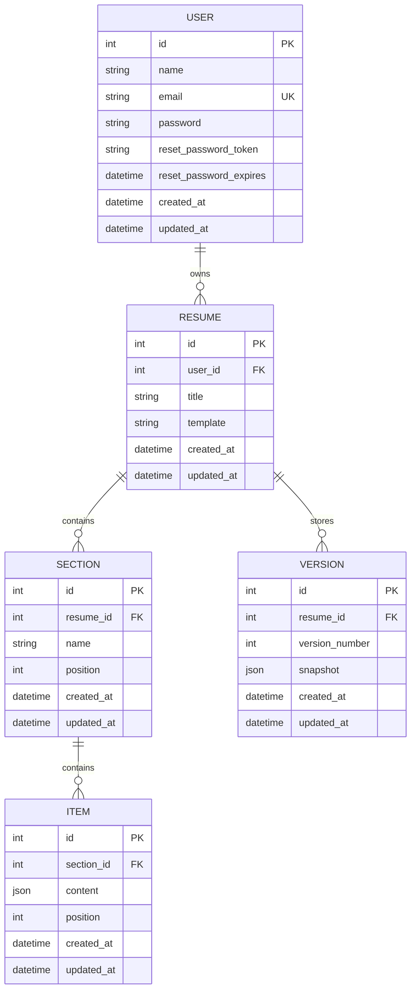

# ResumeFlow API

ResumeFlow is a RESTful backend API for building, managing, importing, duplicating, versioning, and restoring resumes.

Built with **Node.js, Express.js, Sequelize, and MySQL**.

> **Current status:** Core authentication, users, resumes, sections, items, and versions APIs are implemented and tested. Templates and AI are next.

## Tech Stack

- Node.js
- Express.js
- Sequelize ORM
- MySQL
- JWT authentication
- bcrypt password hashing
- REST API
- Postman

## Database Design

```text
User
 │
 └──< Resume
       │
       ├──< Section
       │      └──< Item
       │
       └──< Version
```

### Relationships

- User → many Resumes
- Resume → many Sections
- Section → many Items
- Resume → many Versions

### ER Diagram



## Authentication

Authentication uses JWT.

Protected requests use:

```text
Authorization: Bearer <token>
```

Passwords are hashed using bcrypt through Sequelize model hooks.

## API Endpoints

### Authentication

| Method | Endpoint | Purpose |
|---|---|---|
| POST | `/api/auth/register` | Register a user |
| POST | `/api/auth/login` | Login and receive JWT |
| POST | `/api/auth/logout` | Logout |
| POST | `/api/auth/forgot-password` | Generate password reset token |
| POST | `/api/auth/reset-password` | Reset password using token |

Forgot-password tokens expire after **1 hour**. For this internship implementation, the token is returned directly for testing instead of being sent by email.

### Users

| Method | Endpoint | Purpose |
|---|---|---|
| GET | `/api/users` | Get all users |
| GET | `/api/users/profile` | Get current user profile |
| GET | `/api/users/profile/:id` | Get user by ID |
| PUT | `/api/users/profile` | Update current user profile |

### Resumes

| Method | Endpoint | Purpose |
|---|---|---|
| POST | `/api/resumes` | Create a resume |
| GET | `/api/resumes` | Get all resumes for current user |
| GET | `/api/resumes/:id` | Get a resume |
| PUT | `/api/resumes/:id` | Update a resume |
| DELETE | `/api/resumes/:id` | Delete a resume |
| POST | `/api/resumes/import` | Import/create a resume from parsed data |
| POST | `/api/resumes/:id/duplicate` | Duplicate a resume |

**Import:** supports the mock sources `linkedin` and `file`. The imported resume belongs to the authenticated user.

**Duplicate:** creates a new resume with `Original Title - Copy`, copies the template, and does not copy sections/items or versions.

### Sections

| Method | Endpoint | Purpose |
|---|---|---|
| POST | `/api/resumes/:resumeId/sections` | Create a section |
| GET | `/api/resumes/:resumeId/sections` | Get all sections |
| PATCH | `/api/resumes/:resumeId/sections/:sectionId` | Update/reorder a section |
| DELETE | `/api/resumes/:resumeId/sections/:sectionId` | Delete a section |

Sections use `position` for ordering.

### Items

| Method | Endpoint | Purpose |
|---|---|---|
| POST | `/api/resumes/:resumeId/sections/:sectionId/items` | Create an item |
| PATCH | `/api/resumes/:resumeId/sections/:sectionId/items/:itemId` | Update/reorder an item |
| DELETE | `/api/resumes/:resumeId/sections/:sectionId/items/:itemId` | Delete an item |

Each Item contains JSON `content` and a `position`.

### Versions

| Method | Endpoint | Purpose |
|---|---|---|
| POST | `/api/resumes/:resumeId/versions` | Save a version |
| GET | `/api/resumes/:resumeId/versions` | List saved versions |
| POST | `/api/resumes/:resumeId/versions/:versionId/restore` | Restore a saved version |

Version numbers are generated by the server and are unique per Resume.

The current restore implementation restores the saved Resume `title` and `template` without automatically creating another version.

## Validation & Authorization

Nested resources follow the ownership chain:

```text
Authenticated User
       ↓
     Resume
       ↓
    Section
       ↓
      Item
```

This prevents users from accessing another user's nested resources by changing IDs.

Common responses:

- `200 OK` — successful request
- `201 Created` — resource created
- `400 Bad Request` — invalid request
- `401 Unauthorized` — authentication/token problem
- `404 Not Found` — resource not found
- `409 Conflict` — duplicate/conflicting resource

## Environment Variables

Create `.env`:

```env
PORT=3000

DB_NAME=your_database
DB_USER=your_mysql_user
DB_PASSWORD=your_mysql_password
DB_HOST=localhost
DB_DIALECT=mysql

JWT_SECRET=your_secret
JWT_EXPIRES_IN=1d
```

Do not commit `.env`.

## Installation

```bash
npm install
```

Run migrations:

```bash
npx sequelize-cli db:migrate
```

Start the server:

```bash
npm start
```

The API typically runs at:

```text
http://localhost:3000
```

## Testing

APIs have been tested using Postman.

Recommended order:

```text
Register
   ↓
Login
   ↓
Copy JWT
   ↓
Users
   ↓
Resumes
   ↓
Sections
   ↓
Items
   ↓
Versions
   ↓
Forgot Password
   ↓
Reset Password
```

For protected endpoints, use Postman's **Authorization → Bearer Token** with the JWT returned by Login.

## Project Status

| Module | Status |
|---|---|
| Authentication | Complete |
| Users | Complete |
| Resumes | Complete |
| Sections | Complete |
| Items | Complete |
| Versions | Complete |
| Templates | Next |
| AI | Planned |

## Internship Scope

The project follows the specified internship API scope and avoids unnecessary features.

Completed functionality includes:

- JWT authentication
- Password hashing
- Password reset
- User management
- Resume CRUD
- Resume import
- Resume duplication
- Nested sections
- Nested items
- Resume versioning
- Version restore
- Sequelize relationships
- MySQL persistence
- Postman API testing

## License

Developed for educational/internship purposes.