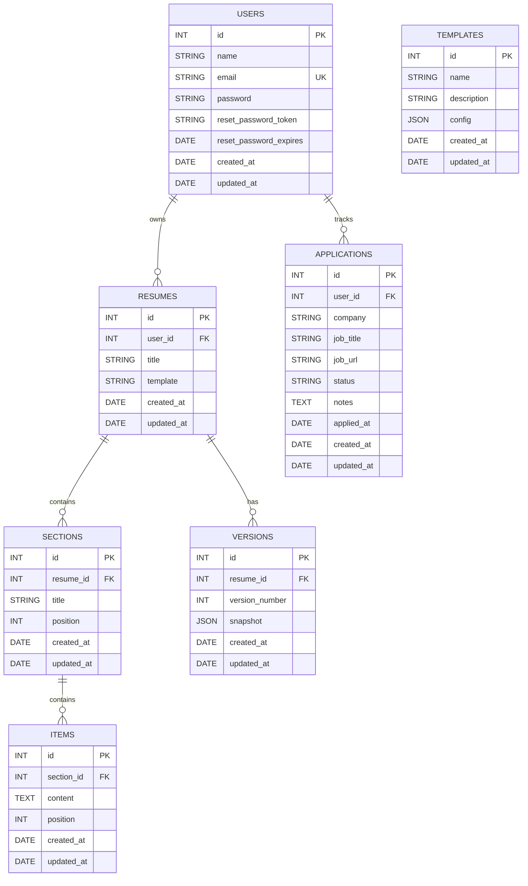

# ResumeFlow 🚀

> A production-style resume management REST API built with Node.js,
> Express.js, Sequelize, and MySQL.

[](https://nodejs.org/)
[](https://expressjs.com/)
[](https://sequelize.org/)
[](https://www.mysql.com/)
[](https://jwt.io/)
[](https://www.npmjs.com/package/bcrypt)
[](https://www.postman.com/)

## Overview

**ResumeFlow** is a modular backend for creating, managing, versioning,
importing, duplicating, and improving resumes while also tracking job
applications.

It was designed to demonstrate real backend engineering rather than
isolated CRUD exercises. The project includes authentication,
authorization, nested resource ownership, relational database design,
migrations, seeders, validation, version snapshots and rollback,
reusable templates, an AI service abstraction, and a job application
tracker.

### Core architecture

``` text
Client / Postman
      │ HTTP + JSON
      ▼
Express Routes
      │
      ├── JWT Middleware
      ▼
Controllers
      │
      ├── validation
      ├── ownership checks
      └── business flow
      ▼
Services
      │
      ▼
Sequelize Models
      │
      ▼
MySQL
```

## ✨ Feature Highlights

### Authentication & security

-   User registration and login
-   bcrypt password hashing
-   JWT authentication
-   Protected endpoints
-   Resource ownership authorization
-   Logout endpoint
-   Forgot-password flow
-   Cryptographically generated reset tokens
-   Token expiration
-   Password reset and token invalidation
-   Email normalization
-   Validation and consistent error responses

### Resume management

-   Resume CRUD
-   Resume import
-   Resume duplication
-   Template assignment
-   User-specific resume ownership

### Structured resume builder

``` text
User
 └── Resume
      └── Section
           └── Item
```

This supports sections such as Summary, Education, Experience, Skills,
Projects, and Certifications.

### Version management

-   Create versions
-   Automatic version numbering
-   Version history
-   JSON snapshots
-   Restore previous versions
-   Unique `(resume_id, version_number)` constraint
-   Cascade deletion with parent resume

### Templates

Global reusable templates are stored in MySQL and configured through
JSON.

Seeded templates: - Modern - Classic - Minimal - Creative - Professional

Example configuration:

``` json
{
  "layout": "two-column",
  "font": "Inter",
  "primaryColor": "#000000",
  "spacing": "comfortable"
}
```

### AI-assisted resume tools

The current implementation uses a mock AI service so the project can run
without an external provider or API key.

-   Bullet generation
-   Professional summary generation
-   Text rewriting
-   General-purpose prompt processing

The controller/service separation makes a real AI provider easy to
integrate later.

### Job application tracker

Users can track: - Company - Job title - Job URL - Status - Notes -
Application date

Supported statuses:

``` text
applied
interview
offer
rejected
withdrawn
```

Every application is isolated to its authenticated owner.

------------------------------------------------------------------------

# 🏗️ Architecture

ResumeFlow follows a layered architecture:

``` text
Request
  ↓
Route
  ↓
Middleware
  ↓
Controller
  ↓
Service
  ↓
Sequelize Model
  ↓
MySQL
```

| Layer | Responsibility |
|---|---|
| **Routes** | Define HTTP endpoints and map requests to controllers |
| **Middleware** | Handle authentication and other cross-cutting concerns |
| **Controllers** | Orchestrate request handling, validation, and responses |
| **Services** | Contain reusable business logic |
| **Models** | Define database schema, relationships, and model-level validation |
| **Migrations** | Track and manage database schema changes |
| **Seeders** | Populate reproducible initial or demo data |
| **Database** | Persist application data using MySQL |

This separation keeps controllers readable and makes business logic
easier to test and replace.

------------------------------------------------------------------------

# 📁 Project Structure

``` text
ResumeFlow/
├── config/
├── controllers/
│   ├── authController.js
│   ├── resumeController.js
│   ├── sectionController.js
│   ├── itemController.js
│   ├── versionController.js
│   ├── templateController.js
│   ├── aiController.js
│   └── applicationController.js
├── middleware/
├── migrations/
├── models/
│   ├── user.js
│   ├── resume.js
│   ├── section.js
│   ├── item.js
│   ├── version.js
│   ├── template.js
│   └── application.js
├── routes/
│   ├── auth.js
│   ├── resumes.js
│   ├── sections.js
│   ├── items.js
│   ├── versions.js
│   ├── templates.js
│   ├── ai.js
│   └── applications.js
├── services/
│   └── aiService.js
├── seeders/
├── utils/
├── models/index.js
├── app.js
├── package.json
├── .env
└── README.md
```

------------------------------------------------------------------------

# 🗄️ Database Design

``` text
users
 ├── resumes
 │    ├── sections
 │    │    └── items
 │    └── versions
 └── applications

templates
```

### Main relationships

``` text
User.hasMany(Resume)
Resume.belongsTo(User)

Resume.hasMany(Section)
Section.belongsTo(Resume)

Section.hasMany(Item)
Item.belongsTo(Section)

Resume.hasMany(Version)
Version.belongsTo(Resume)

User.hasMany(Application)
Application.belongsTo(User)
```

Foreign keys use cascading behavior where appropriate to prevent orphan
records.

### Important schema concepts

-   Primary keys
-   Foreign keys
-   Unique constraints
-   JSON columns
-   Nullable fields
-   Timestamps
-   Cascading deletes
-   Sequelize migrations
-   Sequelize seeders

------------------------------------------------------------------------

# 🔗 ER Diagram

ResumeFlow uses a relational MySQL database where users own resumes and job applications, resumes contain sections and version snapshots, and sections contain individual resume items.



------------------------------------------------------------------------

# 🔐 Authentication

## Register

``` http
POST /api/auth/register
```

``` json
{
  "name": "Deepesh",
  "email": "deepesh@example.com",
  "password": "password123"
}
```

Passwords are processed through bcrypt before persistence.

## Login

``` http
POST /api/auth/login
```

Successful login returns a JWT containing the authenticated user's
identity.

Protected requests use:

``` http
Authorization: Bearer <JWT>
```

Authentication flow:

``` text
Request
  ↓
Read Authorization header
  ↓
Extract JWT
  ↓
Verify JWT
  ↓
Identify user
  ↓
req.user.id
  ↓
Controller
```

## Password reset

``` http
POST /api/auth/forgot-password
POST /api/auth/reset-password
```

The reset workflow uses: - random reset tokens - expiration timestamps -
password hashing through the User model hook - token invalidation after
successful reset

> For a production deployment, the reset token should be delivered
> through a secure email workflow rather than returned directly by the
> API.

------------------------------------------------------------------------

# 🛡️ Authorization & Ownership

Authentication answers:

> Who are you?

Authorization answers:

> Are you allowed to access this resource?

ResumeFlow performs ownership checks on user-owned resources.

Example:

``` js
const application = await Application.findOne({
    where: {
        id,
        userId
    }
});
```

Therefore:

``` text
User A
  ↓
requests User B's application
  ↓
ownership query fails
  ↓
404 Not Found
```

Ownership is enforced across: - Resumes - Sections - Items - Versions -
Applications

Nested resources are validated through their parent relationships.

------------------------------------------------------------------------

# 📚 Complete API Reference

## 🔐 Authentication

| Method | Endpoint | Auth | Purpose |
|---|---|:---:|---|
| `POST` | `/api/auth/register` | ❌ | Register a new user |
| `POST` | `/api/auth/login` | ❌ | Authenticate user and return JWT |
| `POST` | `/api/auth/logout` | ✅ | Log out the authenticated user |
| `POST` | `/api/auth/forgot-password` | ❌ | Generate a password reset token |
| `POST` | `/api/auth/reset-password` | ❌ | Reset the user's password |

---

## 📄 Resumes

| Method | Endpoint | Auth | Purpose |
|---|---|:---:|---|
| `POST` | `/api/resumes` | ✅ | Create a new resume |
| `GET` | `/api/resumes` | ✅ | List the authenticated user's resumes |
| `GET` | `/api/resumes/:id` | ✅ | Get a specific resume |
| `PUT/PATCH` | `/api/resumes/:id` | ✅ | Update a resume |
| `DELETE` | `/api/resumes/:id` | ✅ | Delete a resume |
| `POST` | `/api/resumes/import` | ✅ | Import resume data |
| `POST` | `/api/resumes/:id/duplicate` | ✅ | Duplicate an existing resume |

---

## 🧩 Sections

| Method | Endpoint | Auth | Purpose |
|---|---|:---:|---|
| `POST` | `/api/resumes/:resumeId/sections` | ✅ | Create a section |
| `GET` | `/api/resumes/:resumeId/sections` | ✅ | List resume sections |
| `PUT/PATCH` | `/api/resumes/:resumeId/sections/:sectionId` | ✅ | Update a section |
| `DELETE` | `/api/resumes/:resumeId/sections/:sectionId` | ✅ | Delete a section |

---

## 📝 Items

| Method | Endpoint | Auth | Purpose |
|---|---|:---:|---|
| `POST` | `/api/resumes/:resumeId/sections/:sectionId/items` | ✅ | Create an item |
| `GET` | `/api/resumes/:resumeId/sections/:sectionId/items` | ✅ | List section items |
| `PUT/PATCH` | `/api/resumes/:resumeId/sections/:sectionId/items/:itemId` | ✅ | Update an item |
| `DELETE` | `/api/resumes/:resumeId/sections/:sectionId/items/:itemId` | ✅ | Delete an item |

---

## 🕐 Versions

| Method | Endpoint | Auth | Purpose |
|---|---|:---:|---|
| `POST` | `/api/resumes/:resumeId/versions` | ✅ | Create a resume snapshot |
| `GET` | `/api/resumes/:resumeId/versions` | ✅ | Get version history |
| `POST` | `/api/resumes/:resumeId/versions/restore` | ✅ | Restore a previous version |

---

## 🎨 Templates

| Method | Endpoint | Auth | Purpose |
|---|---|:---:|---|
| `GET` | `/api/templates` | ❌ | List available templates |
| `GET` | `/api/templates/:id` | ❌ | Get a specific template |

---

## 🤖 AI

| Method | Endpoint | Auth | Purpose |
|---|---|:---:|---|
| `POST` | `/api/ai/bullets` | ✅ | Generate resume bullet points |
| `POST` | `/api/ai/summary` | ✅ | Generate a professional summary |
| `POST` | `/api/ai/rewrite` | ✅ | Rewrite resume content |
| `POST` | `/api/ai/prompt` | ✅ | Process a general AI prompt |

---

## 💼 Applications

| Method | Endpoint | Auth | Purpose |
|---|---|:---:|---|
| `POST` | `/api/applications` | ✅ | Create a job application |
| `GET` | `/api/applications` | ✅ | List the user's applications |
| `PATCH` | `/api/applications/:id` | ✅ | Update an application |
| `DELETE` | `/api/applications/:id` | ✅ | Delete an application |

---

### 🔑 Authentication Legend

- ✅ **Protected** — Requires a valid JWT:
  ```http
  Authorization: Bearer <JWT>
  ```

------------------------------------------------------------------------

# 🕐 Versioning & Restore

A resume can have multiple snapshots:

``` text
Resume
 ├── Version 1
 ├── Version 2
 ├── Version 3
 └── Version 4
```

When a version is created:

``` text
Find latest version
      ↓
latest + 1
      ↓
Store JSON snapshot
```

If no version exists:

``` text
versionNumber = 1
```

A database uniqueness constraint prevents duplicate version numbers for
the same resume.

Restore provides a foundation for: - safe experimentation - draft
recovery - undo-like workflows - resume history

------------------------------------------------------------------------

# 🤖 AI Module

The AI architecture is deliberately separated:

``` text
AI Route
   ↓
AI Controller
   ↓
AI Service
   ↓
Mock implementation
```

There is intentionally **no AI Sequelize model** because the current AI
endpoints are stateless:

``` text
Request → Service → Response
```

If future requirements call for AI history, the project can introduce an
`ai_requests` table containing fields such as user, endpoint, prompt,
response, token usage, and timestamps.

### Example --- bullets

``` json
{
  "text": "backend APIs",
  "context": "Node.js internship"
}
```

### Example --- rewrite

``` json
{
  "text": "I made APIs using Node",
  "tone": "professional"
}
```

The service layer means a future real AI provider can replace the mock
implementation without redesigning the routes.

------------------------------------------------------------------------

# 🎨 Templates

Templates are global resources and do not belong to individual users.

Seeded templates:

``` text
Modern
Classic
Minimal
Creative
Professional
```

Template configuration is JSON-driven, for example:

``` json
{
  "layout": "two-column",
  "font": "Inter",
  "primaryColor": "#000000",
  "spacing": "comfortable"
}
```

This allows a future frontend to render layouts dynamically.

------------------------------------------------------------------------

# 💼 Job Application Tracker

The application tracker extends ResumeFlow from resume creation into the
broader job-search workflow.

Example:

``` json
{
  "company": "Google",
  "jobTitle": "Software Engineer",
  "jobUrl": "https://example.com/job",
  "status": "applied",
  "notes": "Applied through careers portal"
}
```

Application lifecycle:

``` text
Applied
   ↓
Interview
   ↓
Offer
```

Alternative outcomes:

``` text
Rejected
Withdrawn
```

The authenticated user ID is always taken from the JWT rather than
trusting a client-provided `userId`.

------------------------------------------------------------------------

# 📥 Import & Duplicate

### Import

Resume import accepts structured data from supported sources such as
LinkedIn or file-based input and creates a new resume.

### Duplicate

A duplicate receives a new database identity while preserving the
relevant resume configuration.

Example:

``` text
"My Resume"
     ↓
"My Resume - Copy"
```

This is useful for tailoring resumes to different roles.

------------------------------------------------------------------------

# ✅ Validation

Validation exists at the model and database levels.

Examples:

### User

-   name required
-   name length
-   valid email
-   unique email
-   password minimum length

### Version

-   integer version number
-   minimum version number of 1
-   required JSON snapshot

### Application

-   company length
-   job title length
-   valid URL when supplied
-   allowed status values
-   optional notes
-   automatic application timestamp

### Items/Sections

-   required parent relationships
-   resource ownership checks

------------------------------------------------------------------------

# 📡 HTTP Status Strategy

    Status Meaning
  -------- --------------------------------------
       200 Successful read/update/delete
       201 Successfully created
       400 Invalid request / validation failure
       401 Authentication failure
       404 Resource not found or inaccessible
       409 Conflict
       500 Unexpected server error

Successful responses generally follow:

``` json
{
  "success": true,
  "message": "Operation completed successfully",
  "data": {}
}
```

Errors:

``` json
{
  "success": false,
  "message": "Resource not found"
}
```

Controllers use `next(error)` for unexpected errors so centralized error
handling can process them.

------------------------------------------------------------------------

# 🧱 Sequelize & Database Workflow

Migrations provide version-controlled database schema changes.

``` bash
npx sequelize-cli db:migrate
```

Undo latest migration:

``` bash
npx sequelize-cli db:migrate:undo
```

Run seeders:

``` bash
npx sequelize-cli db:seed:all
```

Undo seeders:

``` bash
npx sequelize-cli db:seed:undo
```

The project consistently uses:

``` js
timestamps: true,
underscored: true
```

so JavaScript fields such as `userId` map to database fields such as
`user_id`.

------------------------------------------------------------------------

# 🌱 Seed Data

Templates are seeded rather than manually inserted.

``` bash
npx sequelize-cli db:seed:all
```

This makes the environment reproducible for another developer.

------------------------------------------------------------------------

# 🧪 Testing Strategy

The API was developed and tested using Postman.

Testing includes:

### Authentication

-   registration
-   duplicate email
-   valid/invalid login
-   protected routes
-   forgot password
-   invalid/expired reset token
-   password reset

### Resume/content

-   CRUD
-   nested resources
-   ownership
-   import
-   duplicate

### Versions

-   automatic numbering
-   retrieval
-   restore
-   invalid version handling

### Templates

-   list
-   individual lookup
-   invalid ID

### AI

-   successful generation
-   missing required input
-   JWT protection

### Applications

-   create
-   list
-   partial update
-   delete
-   invalid status
-   invalid ID
-   ownership isolation

Recommended end-to-end flow:

``` text
Register
  ↓
Login
  ↓
Copy JWT
  ↓
Create Resume
  ↓
Create Sections
  ↓
Create Items
  ↓
Create Version
  ↓
Use AI endpoints
  ↓
Track Applications
  ↓
Restore a Resume Version
```

------------------------------------------------------------------------

# ⚙️ Setup

## Prerequisites

-   Node.js
-   npm
-   MySQL
-   Git
-   Postman (recommended)

Check versions:

``` bash
node -v
npm -v
```

## Clone

``` bash
git clone <YOUR_REPOSITORY_URL>
cd ResumeFlow
npm install
```

## Environment

Create `.env`:

``` env
PORT=3000

DB_HOST=localhost
DB_PORT=3306
DB_NAME=resumeflow
DB_USER=root
DB_PASSWORD=your_mysql_password

JWT_SECRET=your_super_secret_key
JWT_EXPIRES_IN=1d
```

Never commit real secrets.

Recommended `.gitignore`:

``` gitignore
node_modules/
.env
.env.*
!.env.example
```

## Database

``` sql
CREATE DATABASE resumeflow;
```

Then:

``` bash
npx sequelize-cli db:migrate
npx sequelize-cli db:seed:all
```

Run the server:

``` bash
npm run dev
```

or:

``` bash
npm start
```

Default local URL:

``` text
http://localhost:3000
```

------------------------------------------------------------------------

# 🔄 Development Workflow

The project was built module-by-module:

``` text
Requirements
    ↓
Database design
    ↓
Migration
    ↓
Model + associations
    ↓
Controller
    ↓
Routes
    ↓
Postman tests
    ↓
Validation/debugging
    ↓
Git commit
```

This approach kept each module independently testable and made debugging
database/API mismatches easier.

------------------------------------------------------------------------

# 🧠 Engineering Concepts Demonstrated

### API design

-   RESTful resources
-   HTTP verbs
-   status codes
-   JSON contracts
-   nested routes

### Authentication

-   JWT
-   bcrypt
-   password reset
-   middleware

### Authorization

-   ownership checks
-   nested ownership
-   authenticated user scoping

### ORM

-   Sequelize models
-   associations
-   hooks
-   validation
-   `findOne`
-   `findAll`
-   `create`
-   `save`
-   `destroy`

### Database engineering

-   primary/foreign keys
-   unique constraints
-   JSON
-   migrations
-   seeders
-   cascading deletes
-   timestamps

### Architecture

-   routes
-   middleware
-   controllers
-   services
-   models
-   utilities

------------------------------------------------------------------------

# 🚀 Future Roadmap

The internship/API scope is complete. Possible production improvements
include:

## Authentication

-   refresh tokens
-   email verification
-   real password-reset emails
-   rate limiting
-   session management
-   OAuth

## Resume builder

-   PDF export
-   DOCX export
-   live preview
-   autosave
-   drag-and-drop ordering
-   ATS score
-   public resume URLs

## AI

-   real AI provider integration
-   ATS optimization
-   job-description matching
-   keyword extraction
-   grammar improvement
-   personalized summaries
-   AI usage tracking

## Applications

-   pagination
-   search
-   filtering
-   sorting
-   reminders
-   interview scheduling
-   analytics
-   conversion-rate dashboard

## Engineering

-   unit tests
-   integration tests
-   Swagger/OpenAPI
-   Docker
-   CI/CD
-   structured logging
-   monitoring
-   rate limiting
-   automated backups
-   production deployment

------------------------------------------------------------------------

# 🔒 Production Security Checklist

Before public deployment:

-   [ ] Strong JWT secret
-   [ ] HTTPS
-   [ ] Secure environment variables
-   [ ] Rate limiting
-   [ ] CORS configuration
-   [ ] Security headers
-   [ ] Request validation
-   [ ] Real password-reset email delivery
-   [ ] Database least-privilege account
-   [ ] Dependency vulnerability checks
-   [ ] Logging/monitoring
-   [ ] Database backups
-   [ ] No secrets committed to Git

------------------------------------------------------------------------

# 📊 Project Status

``` text
████████████████████████████████████████ 100%
```

-   [x] Express server
-   [x] MySQL integration
-   [x] Sequelize ORM
-   [x] Migrations
-   [x] Seeders
-   [x] Authentication
-   [x] JWT authorization
-   [x] bcrypt hashing
-   [x] Password reset
-   [x] Resume CRUD
-   [x] Resume import
-   [x] Resume duplication
-   [x] Sections CRUD
-   [x] Items CRUD
-   [x] Version creation/history
-   [x] Version restore
-   [x] Templates
-   [x] AI service layer
-   [x] AI bullets
-   [x] AI summary
-   [x] AI rewrite
-   [x] AI prompt
-   [x] Application tracker
-   [x] Resource ownership
-   [x] Validation
-   [x] Error handling
-   [x] Postman testing
-   [x] Documentation

------------------------------------------------------------------------

# 🏆 Why ResumeFlow Stands Out

ResumeFlow demonstrates more than basic CRUD.

### 1. Security

Authentication is combined with resource-level authorization.

### 2. Nested ownership

The project validates relationships such as:

``` text
User → Resume → Section → Item
```

rather than trusting IDs supplied by clients.

### 3. Versioning

Resume snapshots and rollback introduce real state-management
requirements.

### 4. Service abstraction

AI logic is separated from HTTP controllers and can evolve
independently.

### 5. Database discipline

Schema changes are reproducible through migrations and initial data
through seeders.

### 6. Product-oriented scope

The project connects resume creation, content improvement, version
control, templates, AI assistance, and job tracking into one backend.

------------------------------------------------------------------------

# 🤝 Contributing

``` bash
git checkout -b feature/your-feature
```

Implement and test your changes:

``` bash
git add .
git commit -m "feat: describe your change"
git push origin feature/your-feature
```

Then open a pull request.

------------------------------------------------------------------------

# 👤 Author

**Deepesh Singh**

Backend Development • Node.js • Express.js • MySQL • Sequelize

------------------------------------------------------------------------

## ⭐ Final Note

ResumeFlow was built as a complete backend engineering project with an
emphasis on:

``` text
Correctness
    +
Security
    +
Database integrity
    +
Maintainability
    +
Testability
    +
Extensibility
```

> **ResumeFlow --- Build resumes. Manage versions. Improve content.
> Track opportunities.**
